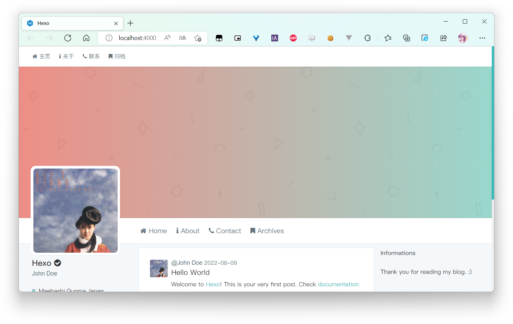

# Inspire
## Introduction
 A Twitter style Hexo theme inspired by another WordPress theme Inspire. Written by Louie. 

 Still under developing ...

 Alpha version released:

 1. Get package with npm or yarn.

    ```shell
    $ npm i hexo-theme-inspire@alpha
    ```

 2. Then copy `_config.yml` in the repository to your blog root directory and rename it as `_config.inspire.yml`.

 3. Enjoy it!
## Completed tasks
* [x] Header
* [x] Footer
* [x] Mobile View
* [x] Post layout
* [x] Code Highlight
* [x] Sidebar
* [ ] Search
* [ ] Pagination
* [ ] Comments Plugins
* [x] Metadata(open graph and Twitter card)
## Preview
